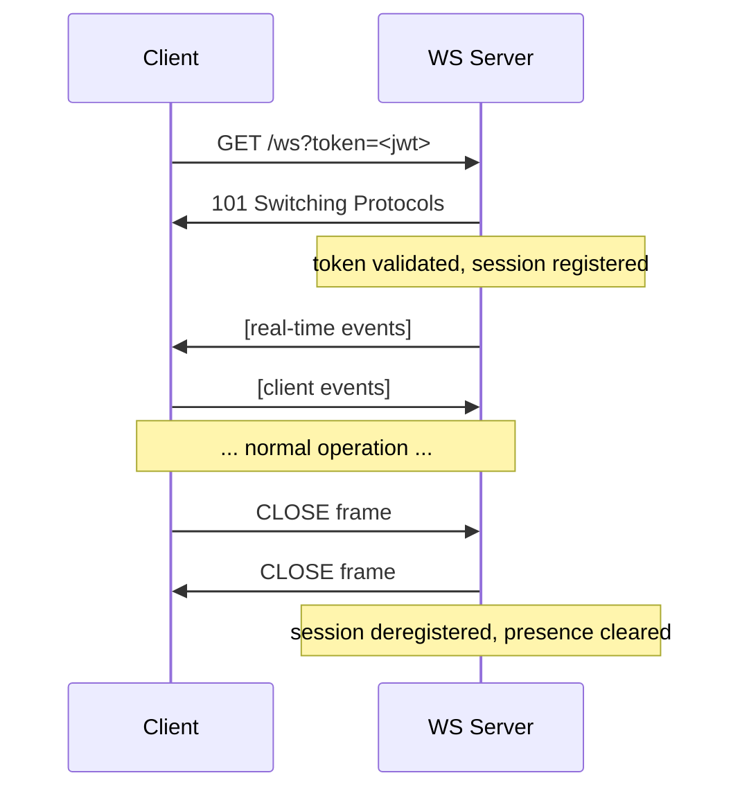

# WebSocket API Documentation

> **Reference standard:** This document follows practical conventions for WebSocket documentation. For industry-standard machine-readable specs, see [AsyncAPI](https://www.asyncapi.com/).

---

## Table of Contents

- [Overview](#overview)
- [Connection](#connection)
- [Authentication](#authentication)
- [Message Format](#message-format)
- [Client → Server Events](#client--server-events)
  - [send_message](#send_message)
- [Server → Client Events](#server--client-events)
  - [message_created](#message_created)
  - [error](#error)
- [Error Codes](#error-codes)
- [Connection Lifecycle](#connection-lifecycle)
- [Reconnection Strategy](#reconnection-strategy)
- [Rate Limiting](#rate-limiting)
- [Architecture Notes](#architecture-notes)

---

## Overview

The WebSocket server provides a persistent, bidirectional connection for real-time chat events. It operates independently from the REST API server — the REST API handles resource management (creating conversations, fetching message history, managing members), while the WebSocket server is responsible exclusively for real-time event delivery.

**Base URL**

```
ws://localhost:8081
wss://your-domain.com   (production)
```

**Protocol**

All messages are JSON-encoded text frames. Binary frames are not used.

---

## Connection

Establish a connection by upgrading an HTTP request to WebSocket at the `/ws` endpoint, passing an authentication token as a query parameter.

```
GET /ws?token=<jwt>
Upgrade: websocket
```

**Example (JavaScript)**

```js
const socket = new WebSocket(`wss://your-domain.com/ws?token=${accessToken}`);

socket.addEventListener('open', () => {
  console.log('Connected');
});

socket.addEventListener('message', (event) => {
  const payload = JSON.parse(event.data);
  console.log(payload);
});
```

---

## Authentication

Authentication is performed at connection time via a signed JWT passed as the `token` query parameter. The server validates the token before the WebSocket handshake completes.

- Tokens are obtained from the REST API (`POST /auth/token`).
- If the token is missing, expired, or invalid, the server rejects the upgrade with `HTTP 401`.
- Token refresh is not handled over the WebSocket connection — clients must reconnect with a fresh token when one expires.

**Connection rejection responses**

| HTTP Status | Reason |
|-------------|--------|
| `401 Unauthorized` | Missing or invalid token |
| `403 Forbidden` | Valid token but account suspended |
| `429 Too Many Requests` | Connection rate limit exceeded |

---

## Message Format

Every frame exchanged between client and server shares a common envelope:

```ts
{
  "event": string,       // Event name (e.g. "send_message", "message_created")
  "data":  object,       // Event-specific payload
  "ref":   string | null // Optional client-generated idempotency key (echoed back)
}
```

- `event` — identifies the event type.
- `data` — the event payload; shape varies per event (documented below).
- `ref` — an optional client-generated string (UUID recommended) used to correlate a sent frame with its server acknowledgement. The server echoes the `ref` back on the corresponding ack or error frame.

---

## Client → Server Events

### `send_message`

Send a new message to a conversation.

**Frame**

```json
{
  "event": "send_message",
  "ref":   "a1b2c3d4",
  "data": {
    "conversation_id": "conv_01J...",
    "content":         "Hello, world!"
  }
}
```

**Fields**

| Field | Type | Required | Description |
|-------|------|----------|-------------|
| `conversation_id` | `string` | ✓ | ID of the target conversation |
| `content` | `string` | ✓ | Message text (max 4000 characters) |

**Server acknowledgement**

On success the server emits a `message_created` event (see [Server → Client Events](#server--client-events)) broadcast to all members of the conversation, including the sender.

On failure the server emits an `error` event with the `ref` echoed back.

---

## Server → Client Events

### `message_created`

Emitted when a new message is created in a conversation the connected user is a member of.

**Frame**

```json
{
  "event": "message_created",
  "ref":   "a1b2c3d4",
  "data": {
    "message": {
      "id":              "msg_01J...",
      "conversation_id": "conv_01J...",
      "sender_id":       "user_01J...",
      "content":         "Hello, world!",
      "created_at":      "2024-11-01T10:00:00Z"
    }
  }
}
```

- The `ref` field echoes the sender's original `ref`. For other recipients the `ref` is `null`.

---

### `error`

Emitted when the server cannot process a client-sent event.

**Frame**

```json
{
  "event": "error",
  "ref":   "a1b2c3d4",
  "data": {
    "code":    "NOT_MEMBER",
    "message": "You are not a member of this conversation"
  }
}
```

- `ref` — echoes the `ref` from the client frame that caused the error.
- `code` — machine-readable error code (see [Error Codes](#error-codes)).
- `message` — human-readable description for debugging.

---

## Error Codes

| Code | Trigger |
|------|---------|
| `NOT_MEMBER` | Attempted to send to a conversation the user is not a member of |
| `CONVERSATION_NOT_FOUND` | `conversation_id` does not exist |
| `CONTENT_EMPTY` | Message `content` was empty or whitespace only |
| `CONTENT_TOO_LONG` | Message `content` exceeded the 4000 character limit |
| `RATE_LIMITED` | Client exceeded the send rate limit |
| `UNAUTHORIZED` | Token expired mid-session; client must reconnect |
| `INTERNAL_ERROR` | Unexpected server error |

---

## Connection Lifecycle



**Ping / Pong**

The server sends a WebSocket `ping` frame every **30 seconds**. Clients should respond with a `pong` frame. If no pong is received within **10 seconds**, the server closes the connection with code `1001 (Going Away)`.

Most browser WebSocket implementations handle ping/pong automatically. Native clients must implement it explicitly.

---

## Reconnection Strategy

The WebSocket connection can drop due to network interruptions, token expiry, or server restarts. Clients should implement exponential backoff with jitter:

```
base_delay  = 1s
max_delay   = 60s
delay(n)    = min(base_delay × 2^n, max_delay) + random(0, 1s)
```

**Handling missed events after reconnect**

The WebSocket server does not replay events missed during a disconnection. After reconnecting, clients should re-fetch conversation state via the REST API before resuming real-time updates:

1. Reconnect the WebSocket.
2. Call `GET /conversations/{id}/messages?after=<last_seen_message_id>` for each active conversation to catch up on missed messages.
3. Resume normal WebSocket event handling.

**Do not reconnect** if the close code indicates a permanent failure:

| Close Code | Reason | Action |
|------------|--------|--------|
| `4001` | Invalid or expired token | Refresh token via REST, then reconnect |
| `4003` | Account suspended | Do not reconnect |
| `4429` | Connection rate limit | Back off significantly before reconnecting |
| `1001` | Server going away | Reconnect with backoff |
| `1006` | Abnormal closure / network drop | Reconnect with backoff |

---

## Rate Limiting

| Limit | Value |
|-------|-------|
| Max connections per user | 5 simultaneous sessions |
| `send_message` events | 30 per minute per connection |

Exceeding a rate limit triggers an `error` event with code `RATE_LIMITED`. Persistent violation may result in the connection being closed with code `4429`.

---

## Architecture Notes

The WebSocket server is horizontally scalable. Multiple server instances fan out real-time events across nodes via **Redis Pub/Sub** — a message sent on one instance is relayed to all other instances so that members connected to different nodes all receive it.

This means:

- **Stateless connection handling** — any instance can serve any user.
- **No sticky sessions required** — clients can reconnect to a different instance after a drop without loss of functionality (though missed events during the gap must be recovered via the REST API, as described above).
- **Presence tracking** — online/offline state is coordinated through Redis so all instances share a consistent view of which users are connected.

For REST API reference, see [`docs/api/rest.yaml`](./rest.yaml) (OpenAPI).